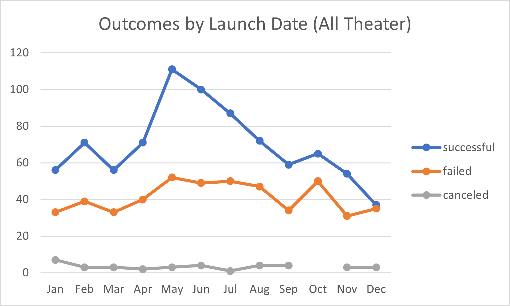
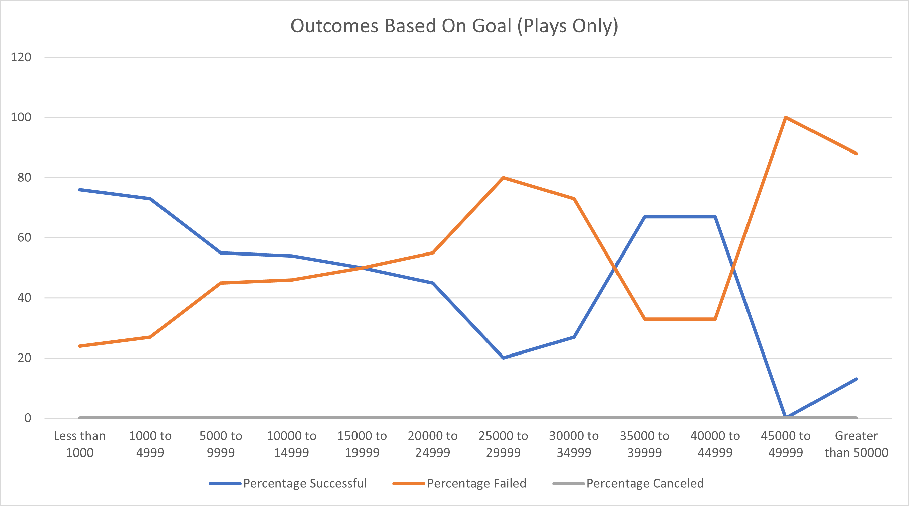

# Kickstarting with Excel

## Overview of Project

### Purpose

To determine whether there is an optimal Kickstarter launch date and goal amount for theater campaigns that will lead to a successful outcome. This is done by filtering, charting, and analyzing raw Kickstarter data imported into Excel.

## Analysis and Challenges

### Analysis of Outcomes Based on Launch Date

One of our goals was to determine whether there was an ideal month of the year for a campaign to launch. The possible outcomes for a kickstarter (Successful, Failed, Cancelled) were counted up for each month of the calendar year across all years where data was available (2009-2017) by using an Excel PivotChart, filtered by the "Theater" category. Because dates were retrieved in a Unix format, they had to be converted to a standardized `DD/MM/YYYY` format to be able to extract the month.  The resulting line plot can be seen above.

### Analysis of Outcomes Based on Goals

Because Kickstarters will only be funded if the goal is met, it's important that a goal is set appropriately for the type of campaign -- in this case, a play.

### Challenges and Difficulties Encountered

## Results

- What are two conclusions you can draw about the Outcomes based on Launch Date?

- What can you conclude about the Outcomes based on Goals?

- What are some limitations of this dataset?

- What are some other possible tables and/or graphs that we could create?
